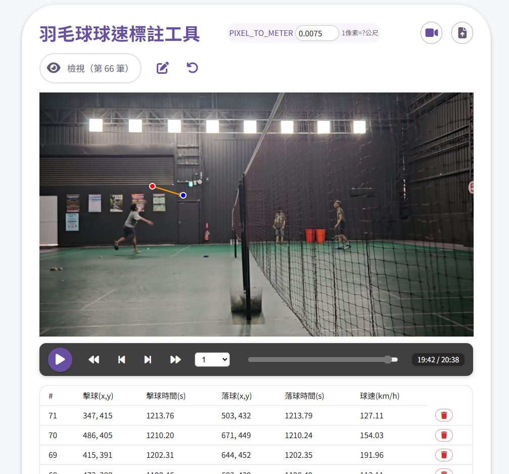

# 羽毛球球速標註工具 (Badminton Speed Tagging Tool)

這是一個基於 React.js 與 Vite 的 Web 工具，協助使用者分析羽毛球影片、標註擊球點與落點，並自動計算球速。支援影片上傳、標記、球速計算、CSV 匯出等功能，適合教練、選手或愛好者進行技術分析。

## 系統截圖



---

## 目錄
- [功能特色](#功能特色)
- [安裝與啟動](#安裝與啟動)
- [如何使用](#如何使用)
- [專案結構](#專案結構)
- [技術細節](#技術細節)
- [常見問題](#常見問題)
- [貢獻指南](#貢獻指南)
- [聯絡方式](#聯絡方式)
- [授權](#授權)

---

## 功能特色

- **影片上傳與播放**：支援 mp4、mov 等常見格式，具備播放/暫停、逐幀/逐秒快進快退、播放速度調整。
- **視覺化標記**：可於影片畫面直接標記擊球點與落點，並即時顯示於畫面上。
- **自動球速計算**：根據標記點的像素距離與時間差，自動計算球速（支援自訂像素與公尺轉換比例）。
- **CSV 數據匯出**：可將所有標記點座標、時間戳、計算球速等資料匯出為 CSV 檔案。
- **CSV 匯入**：可從 CSV 檔案匯入標記與球速資料，方便資料備份與跨裝置編輯。
- **影片拍攝時間解析**：自動解析影片元數據中的拍攝時間，並應用於匯出資料。
- **快捷鍵支援**：提升操作效率。
- **標籤/檢視/編輯模式切換**：可在標籤模式（新增標記）、檢視模式（僅瀏覽標記）、編輯模式（調整或刪除標記）間切換，提升操作彈性。

## 安裝與啟動

1. **安裝 Node.js 與 npm**（建議 Node.js 18+）。
2. 下載本專案後，於專案根目錄執行：
   ```sh
   npm install
   ```
3. 啟動開發伺服器：
   ```sh
   npm run dev
   ```
4. 預設瀏覽器將自動開啟，或手動前往 http://localhost:5173

## 如何使用

1. **上傳影片**：點擊「選擇影片」按鈕，上傳羽毛球影片。
2. **設定 PIXEL_TO_METER 比例**：於右上角調整「PIXEL_TO_METER」數值（1 像素等於多少公尺），建議以場地已知物體（如底線長度 13.4 公尺）作為參考。
3. **切換模式**：
   - 透過介面上的模式切換按鈕，可在「標籤模式」（可新增標記）、「檢視模式」（僅瀏覽標記，避免誤操作）、「編輯模式」（可調整或刪除標記）間切換。
   - 選擇合適模式以符合不同操作需求。
4. **標記擊球點與落點**：
   - 播放影片時，點擊畫面新增標記。
   - **擊球點**：球拍與球接觸時點擊。
   - **落點**：羽球落地時點擊。
   - 每組標記（擊球點+落點）自動計算球速，並顯示於下方表格。
   - 支援快捷鍵：
     - `空白鍵`：播放/暫停
     - `左方向鍵`：後退一幀（連按為一秒）
     - `右方向鍵`：前進一幀（連按為一秒）
     - `A`：降低播放速度
     - `D`：提高播放速度
5. **查看與編輯數據**：
   - 下方表格列出所有標記及球速。
   - 點擊表格列可跳轉至對應擊球點。
   - 可刪除與重新標註不正確的標記。
6. **匯出 CSV**：
   - 點擊「匯出 CSV」按鈕，下載所有標記與球速資料。
   - CSV 包含：擊球點/落點 X/Y 座標、影片時間戳、實際時間戳、球速。
7. **匯入 CSV**：
   - 點擊「匯入 CSV」按鈕，選擇先前匯出的標記與球速資料檔案。
   - 匯入後，標記與球速資料會自動載入並顯示於表格。

## 專案結構

```
.gitignore             # 忽略檔案設定
index.html             # 入口 HTML
package.json           # 專案依賴與腳本
vite.config.js         # Vite 設定
public/
    mediainfo.wasm     # 影片元數據解析用 WASM
src/
    App.jsx, App.css   # 主應用程式與樣式
    main.jsx           # React 入口
    index.css          # 全域樣式
    components/        # React 元件
        ExportCSVButton.jsx   # 匯出 CSV 按鈕
        PairsTable.jsx        # 標記與球速資料表格
        PixelToMeterInput.jsx # PIXEL_TO_METER 輸入元件
        StatusBar.jsx         # 狀態列（顯示模式/比例等）
        VideoPlayer.jsx       # 影片播放器主元件
        video/                # 影片相關子元件
            PlayPauseButton.jsx   # 播放/暫停按鈕
            TimeDisplay.jsx       # 時間顯示
            VideoControls.jsx     # 影片控制列
            VideoMarkers.jsx      # 標記點渲染
            VideoOverlay.jsx      # 影片上方互動層
    utils/               # 工具函式
        speedCalc.js     # 球速計算邏輯
```

## 技術細節
- **前端框架**：React.js (Vite)
- **UI 框架**：Material-UI (MUI)
- **影片處理**：HTML5 `<video>` 元素，`mediainfo.js` 解析影片元數據
- **數據處理**：`papaparse` 進行 CSV 匯出
- **主要自訂模組**：
  - `src/utils/speedCalc.js`：計算球速

## 常見問題

- **Q：影片無法上傳或播放？**
  - 請確認影片格式支援（如 mp4、mov 等），並檢查瀏覽器支援度。
- **Q：球速計算不準？**
  - 請正確設定 PIXEL_TO_METER 比例，建議以場地已知長度作為參考。
- **Q：影片拍攝時間無法解析？**
  - 部分影片可能缺乏完整元數據，請確認影片來源。

## 貢獻指南

歡迎任何形式的貢獻！
- 發現 Bug 或有建議，請提出 Issue。
- 歡迎提交 Pull Request，請遵循專案程式風格。
- 如需協助，請於 GitHub Issue 留言。

## 聯絡方式

如需協助，請於 GitHub Issue 留言。

## 授權

本專案採用 MIT License。